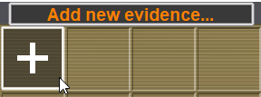
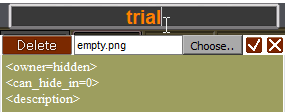
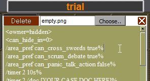
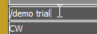
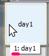

# Server Demo Guide and Snippets

Create new evidence:  
  
Name it something (for example, trial):  
  
Copy everything from the "demo" section of your chosen template, and paste everything into the description:  
  
Finally, to start playback, do `/demo trial` (the evidence name) in OOC.  
  
You can alternatively use the evidence index you get from mousing over it:  
  

# How to Make

The demo line can be a [command](https://crystalwarrior.github.io/KFO-website/commands.html), or a [packet](https://github.com/AttorneyOnline/docs/blob/master/docs/Development/network/Packet%20Reference.md). Each command of the Demo has to end with a `%`; packets can be multiline as long as the packet is closed with `%`.  
Only a limited number of packets are recognized: ["MS"](https://github.com/AttorneyOnline/docs/blob/master/docs/Development/network/MS%20Packet%20Reference.md)(server), ["CT"](https://github.com/AttorneyOnline/docs/blob/master/docs/Development/network/Packet%20Reference.md#CT-Server), ["MC"](https://github.com/AttorneyOnline/docs/blob/master/docs/Development/network/Packet%20Reference.md#MC), ["BN"](https://github.com/AttorneyOnline/docs/blob/master/docs/Development/network/Packet%20Reference.md#BN), ["HP"](https://github.com/AttorneyOnline/docs/blob/master/docs/Development/network/Packet%20Reference.md#HP), ["JD"](https://github.com/AttorneyOnline/docs/blob/master/docs/Development/network/Packet%20Reference.md#JD), "wait". Wait packet is formatted like `wait#1000%` where `1000` is the number of milliseconds to wait for before reaching the next demo line \- 1000 milliseconds is 1 second.  
Meanwhile, all commands are recognized, but it simply makes the client who runs the `/demo` the one to call those commands.  
You can set up a trigger using the `/trigger` trig cmd arg(s) command. When the trigger is fulfilled, it will call the specified cmd with the provided arg(s). For example:  
`/trigger join demo hi` will call `/demo hi` when someone joins the area.  
If a demo is started through a `/trigger`, it searches for a GM, then a CM if a GM is not found in the hub. This means the commands respect all client-specific stipulations as well \- such as a GM having `/broadcast all` would play the demo as if the client was saying it.

In the below example, the button is set up using `/trigger present 1 demo push`. As a result, presenting the button will cause the GM client to call `/demo push` from within the correct area.  


## Demo Template

### Description:

This is a description.

### Demo:
```
/command arg%
wait#1000%
MS#1#-#CM 1##lol#wit#0#1#0#0#0#0#0#0#3# #-1###%
```
---

## Automated Class Trial

### Description:

This demo playback allows you to fully automate the Class Trial system according to the [Pants DR Rules](https://docs.google.com/document/d/1ZLjIIroLOlrWUUoiSQAy2AbUOV_BCY_NXb7Oy_WGkMg/edit#).

### Demo:

```
/area_pref can_cross_swords true%
/area_pref can_scrum_debate true%
/area_pref can_panic_talk_action false%
/minigame_start_song cs [YOUR SONG PATH HERE]%
/minigame_start_song sd [YOUR SONG PATH HERE]%
/minigame_start_song pta [YOUR SONG PATH HERE]%
/minigame_end_song cs [YOUR SONG PATH HERE]%
/minigame_end_song sd [YOUR SONG PATH HERE]%
/minigame_end_song pta [YOUR SONG PATH HERE]%
/timer 2 10s%
/timer 2 /doc [YOUR CASE DOC HERE]%
/timer 2 /timer 2 unset%
/timer 2 /timer 1 start%
/timer 2 /timer 5 start%
/timer 2 /timer 6 start%
/timer 1 2h%
/timer 1 /concede not-pta%
/timer 1 /area_mute%
/timer 5 1h%
/timer 5 /area_pref can_panic_talk_action true%
/timer 6 1h57m30s%
/timer 6 /area_pref can_panic_talk_action false%
/timer 2 start%
wait#10000%
MS#1#-#CM 1##}}}Your devices emit a `*beep*` as the case doc is uploaded to them! (Check OOC or /doc for the link)#wit#dead_activate#1#0#0#0#0#0#0#3# #-1###% 
```
